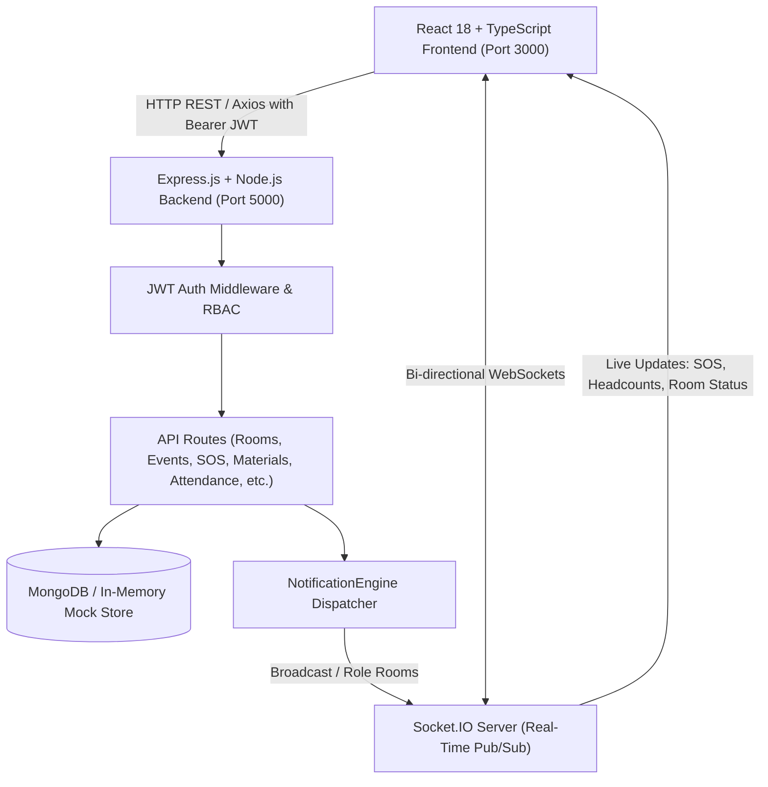

# 🎓 Smart Campus Management Platform — Engineering Handover Documentation

> **Version:** 1.0.0-production  
> **Platform:** Full-Stack Real-Time Smart Campus Management & Academic Hub  
> **Author/Maintainer:** Development Team  
> **Target Audience:** Engineering, DevOps, System Administrators, and Product Teams  

---

## 📑 Table of Contents

1. [Executive Summary](#1-executive-summary)
2. [High-Level System Architecture](#2-high-level-system-architecture)
3. [Technology Stack](#3-technology-stack)
4. [Repository Directory Structure](#4-repository-directory-structure)
5. [Core Modules & Feature Breakdown](#5-core-modules--feature-breakdown)
6. [Authentication, RBAC & Demo Accounts](#6-authentication-rbac--demo-accounts)
7. [REST API Reference](#7-rest-api-reference)
8. [WebSocket Real-Time Event Dictionary](#8-websocket-real-time-event-dictionary)
9. [Data Models & Schema Reference](#9-data-models--schema-reference)
10. [Local Development & Setup Guide](#10-local-development--setup-guide)
11. [Configuration & Environment Variables](#11-configuration--environment-variables)
12. [Design System & UI Tokens](#12-design-system--ui-tokens)
13. [Operational Notes, Quirks & Troubleshooting](#13-operational-notes-quirks--troubleshooting)
14. [Production Deployment & Future Roadmap](#14-production-deployment--future-roadmap)

---

## 1. Executive Summary

The **Smart Campus Management Platform** is a unified, real-time campus operating system designed for higher education institutions (such as NLU). It centralizes everyday student and administrative tasks:

- **Emergency SOS & Geo-Beacon Dispatch:** Real-time safety sirens, active incident banners, and security dispatch consoles.
- **Interactive Wayfinding & Multi-Block Navigation:** Visual 2D campus maps with accessible routing, room availability overlays, and emergency exits.
- **Study Materials & Academic Resource Exchange:** Crowdsourced past papers (PYQs), lecture notes, syllabus guides, upvoting, and category filters.
- **Smart Room Management & Booking Engine:** Live room availability, automated conflict prevention, and admin floor controls.
- **Campus Events & Auto-Room Reservation:** Event publishing with automated room reservations and RSVP tracking.
- **Real-Time QR Attendance System:** Rotating/static QR generation, live WebSocket headcounts, and low-attendance warnings.
- **Lost & Found Cross-Matching Board:** Item listing with automated text similarity cross-matching between lost and found entries.
- **Facilities & Maintenance Ticketing:** Integrated complaint logging that updates room maintenance statuses.
- **Centralized Notification Engine:** Role-targeted, user-targeted, and campus-wide real-time broadcasts.

### Key Operational Strength: Zero-Friction Fallback
The platform features **dual-mode persistence**: if a live MongoDB instance is connected, it uses full database persistence; if MongoDB is unavailable or fails to connect, the backend gracefully activates an **in-memory demo fallback**, allowing evaluation, automated tests, or local reviews to function without external database dependencies.

---

## 2. High-Level System Architecture



---

## 3. Technology Stack

### Frontend
- **Framework:** React 18.2 with TypeScript 5.9
- **Routing:** React Router v6 (`react-router-dom`)
- **Real-Time Communication:** `socket.io-client` v4.6
- **Styling:** Custom CSS Design Tokens & Utilities (Warm & Earthy Institutional Theme)
- **Icons:** `lucide-react`
- **QR Operations:** `qrcode.react` (generation) & `react-qr-reader` (scanning)
- **Notifications & Feedback:** `react-hot-toast`
- **Date Handling:** `date-fns` v3.2

### Backend
- **Runtime:** Node.js (v16+ recommended, v18/v20 LTS supported)
- **Framework:** Express.js v4.18
- **WebSockets:** Socket.IO v4.6
- **Database / ODM:** MongoDB via Mongoose v8.0 (with automatic in-memory mock fallback)
- **Security & Authentication:** `jsonwebtoken` (JWT), `bcryptjs`
- **File Uploads:** `multer` (for study materials & attachments)
- **Utilities:** `uuid`, `dotenv`, `cors`

---

## 4. Repository Directory Structure

```
coffee to code/
├── backend/
│   ├── config/
│   │   └── db.js                 # MongoDB connection logic with demo fallback
│   ├── middleware/
│   │   └── auth.js               # JWT verification & RBAC authorization middleware
│   ├── models/
│   │   ├── Attendance.js         # QR sessions & student check-in records
│   │   ├── Booking.js            # Room reservations & conflict detection
│   │   ├── Complaint.js          # Facilities & maintenance issue tickets
│   │   ├── Emergency.js          # SOS distress records & geolocation logs
│   │   ├── Event.js              # Campus events & RSVP rosters
│   │   ├── LostFound.js          # Lost & found listings & matches
│   │   ├── Notification.js       # Stored notification records
│   │   ├── Room.js               # Campus spaces, capacities & live statuses
│   │   ├── StudyMaterial.js      # Notes, PYQs, syllabi & upvotes
│   │   └── User.js               # Users, roles (student/faculty/admin), departments
│   ├── routes/
│   │   ├── attendance.js         # QR code attendance & WebSocket session stream
│   │   ├── auth.js               # Login, register, profile & demo accounts
│   │   ├── complaints.js         # Issue reporting & maintenance workflow
│   │   ├── emergency.js          # SOS alerts & incident resolution
│   │   ├── events.js             # Event creation & room auto-booking
│   │   ├── lostfound.js          # Item reports & similarity matching
│   │   ├── notifications.js      # User notifications & broadcast composer
│   │   ├── rooms.js              # Room availability & booking engine
│   │   └── studyMaterials.js     # Study materials hub, filters, votes & downloads
│   ├── services/
│   │   └── NotificationEngine.js # Cross-module event dispatcher & notification router
│   ├── seed.js                   # Database seeder script
│   ├── server.js                 # Express server & Socket.IO initialization
│   ├── package.json
│   └── package-lock.json
│
├── frontend/
│   ├── public/
│   │   └── index.html            # HTML shell with Google Fonts & meta tags
│   ├── src/
│   │   ├── components/
│   │   │   ├── EmergencyBanner.tsx   # Floating red emergency alert banner
│   │   │   ├── Navbar.tsx            # Top header with user profile & alert trigger
│   │   │   ├── NluLogo.tsx           # University heraldic vector crest
│   │   │   ├── NluSkylineBanner.tsx  # Architectural campus skyline SVG banner
│   │   │   ├── NotificationPanel.tsx # Slide-out notification tray
│   │   │   ├── ProtectedRoute.tsx    # Route guard & role permissions check
│   │   │   ├── Sidebar.tsx           # Module navigation sidebar
│   │   │   └── SosButton.tsx         # Red floating emergency distress trigger
│   │   ├── context/
│   │   │   ├── AuthContext.tsx       # Auth state, token persistence & role switches
│   │   │   └── NotificationContext.tsx# Live Socket.IO listener & badge counter
│   │   ├── hooks/
│   │   │   ├── index.js              # Unified hooks barrel export
│   │   │   ├── useAttendance.js      # QR attendance & real-time headcounts
│   │   │   ├── useDebounce.js        # Search input debouncing utility
│   │   │   ├── useEmergency.js       # SOS distress beacons & geolocation
│   │   │   ├── useLocalStorage.js    # Persistent browser storage handler
│   │   │   ├── useRooms.js           # Live availability & socket updates
│   │   │   └── useSocket.js          # Declarative WebSocket subscriptions
│   │   ├── pages/
│   │   │   ├── AttendancePage.tsx    # QR attendance creator & mobile scanner
│   │   │   ├── ComplaintsPage.tsx    # Facilities issue tickets & maintenance tracking
│   │   │   ├── DashboardPage.tsx     # Overview metrics, announcements & quick links
│   │   │   ├── EmergencyPage.tsx     # Admin SOS incident control center
│   │   │   ├── EventsPage.tsx        # Campus events, RSVPs & room integration
│   │   │   ├── LoginPage.tsx         # Auth screen with 1-click role quick-fill
│   │   │   ├── LostFoundPage.tsx     # Lost & found board with similarity match
│   │   │   ├── NavigationPage.tsx    # Interactive campus map & wayfinding
│   │   │   ├── NotificationsPage.tsx # Notification center & broadcast composer
│   │   │   ├── RoomsPage.tsx         # Live room availability & booking
│   │   │   └── StudyMaterialsPage.tsx# Academic repository (notes, PYQs, syllabus)
│   │   ├── services/
│   │   │   ├── attendanceService.ts  # QR sessions & check-in API
│   │   │   ├── authService.ts        # Authentication & token management
│   │   │   ├── complaintService.ts   # Maintenance tickets API
│   │   │   ├── emergencyService.ts   # SOS distress & resolution API
│   │   │   ├── eventService.ts       # Campus events & room auto-booking
│   │   │   ├── index.ts              # Unified services barrel export
│   │   │   ├── lostFoundService.ts   # Lost items & similarity matching
│   │   │   ├── notificationService.ts# Announcements & notifications
│   │   │   └── roomService.ts        # Room availability & reservations
│   │   ├── types/
│   │   │   └── index.ts              # TypeScript interfaces for all campus domain entities
│   │   ├── utils/
│   │   │   ├── api.ts                # Axios client with JWT interceptor
│   │   │   └── socket.ts             # Socket.IO client manager
│   │   ├── App.tsx                   # Main router, layout wrapper & toast setup
│   │   ├── index.css                 # Master CSS design system, variables & tokens
│   │   └── index.tsx                 # React DOM entry point
│   ├── tsconfig.json
│   ├── package.json
│   └── package-lock.json
│
├── Handover.md                       # Engineering Handover Documentation (this file)
└── README.md                         # Quick Start & Project Overview
```

---

## 5. Core Modules & Feature Breakdown

### 5.1. Emergency SOS & Security Geo-Beacon
- **Trigger:** Any logged-in user can click the floating red SOS button or use the `/emergency` route.
- **Data Collected:** Latitude/Longitude via HTML5 Geolocation API, building block, specific location/landmark, nature of emergency, and optional note.
- **Dispatch Mechanism:** `POST /api/emergency/sos` triggers `NotificationEngine.publish()` and emits `emergency_alert` to all connected WebSocket clients.
- **Audio-Visual Feedback:** Active red emergency banner appears on all user screens; dispatch console plays an alert siren.
- **Admin Dispatch Console (`/emergency`):** Admin-only view listing active and resolved incidents with timestamps, reporter details, interactive location pins, and a one-click resolve action.

### 5.2. Interactive Campus Navigation & Wayfinding
- **Map View:** High-fidelity vector SVG map covering Academic Block A, Academic Block B, Science & Computing Block C, Admin Tower, and the Student Hub.
- **Floor Switcher:** Interactive toggle between Ground Floor (Floor 0), Floor 1, and Floor 2.
- **Real-Time Room Status:** Rooms on the map are dynamically color-coded based on live status (Available = Green, Occupied = Red, Maintenance = Orange).
- **Routing Engine:** Turn-by-turn path calculation connecting user starting location to destination with:
  - Accessible / Wheelchair-friendly route option (prioritizing elevators/ramps).
  - Emergency evacuation route mode highlighting nearest fire exits.

### 5.3. Study Materials & Academic Repository Hub
- **Access Route:** `/study-materials`
- **Categories:** Lecture Notes, Previous Year Question Papers (PYQs), Syllabus & Curriculum Guides, Reference Textbooks, Lab Manuals.
- **Filtering & Search:** Instant filter by Department, Semester (1 to 8), Resource Category, Course Code, and full-text keyword search.
- **Interactions:**
  - Upvote / Downvote toggle with live counter.
  - Download count tracking.
  - Contribution modal supporting direct URL linking or local file uploads.
- **Role Permissions:** Students and Faculty can upload; Admin and original author can remove resources.

### 5.4. Smart Room Management & Booking Engine
- **Access Route:** `/rooms`
- **Features:** Live filter by Block, Floor, Capacity, and Status (Available, Occupied, Maintenance, Reserved).
- **Booking Rules:**
  - Faculty & Admin can reserve rooms for lectures, seminars, or labs.
  - Conflict checking: Backend validates time-slot overlaps before granting reservations.
  - Facilities integration: When a room is placed under maintenance (via Complaints), its status immediately updates to `maintenance` and blocks reservations.

### 5.5. Real-Time QR Attendance System
- **Access Route:** `/attendance`
- **Faculty Capabilities:**
  - Create a live session specifying Subject, Course Code, and Duration.
  - Displays a high-contrast dynamic QR code containing a cryptographically signed check-in payload.
  - Real-time headcount updates via WebSocket (`attendance_update`) without page refreshes.
- **Student Capabilities:**
  - Open webcam/mobile camera scanner to scan the QR code.
  - One-click backup check-in button for devices without cameras.
  - Low-attendance warning indicator if attendance rate falls below 75%.

### 5.6. Campus Events & Auto-Room Reservation
- **Access Route:** `/events`
- **Integrated Room Booking:** Creating an event with an assigned room automatically creates a corresponding room reservation in the Booking engine to prevent double-booking.
- **RSVP Tracking:** Students can RSVP with one click; live attendee count updates in real-time.
- **Event Categorization:** Academic, Cultural, Sports, Career, and Workshop.

### 5.7. Lost & Found Cross-Matching System
- **Access Route:** `/lostfound`
- **Smart Matching Engine:** When a user logs a "Lost" or "Found" item, the backend automatically performs a text similarity match across active entries and alerts matching parties.
- **Resolution Workflow:** Users can mark items as "Claimed" or "Returned", archiving the item from the active board.

### 5.8. Facilities & Maintenance Ticketing
- **Access Route:** `/complaints`
- **Ticketing Flow:**
  - Users report issues categorised by Electrical, Plumbing, IT & AV, Furniture, or Cleanliness.
  - Optional Room linking: Linking a ticket to a room can automatically transition room status to `maintenance`.
  - Admins can update status from `submitted` ➔ `in_progress` ➔ `resolved`.

### 5.9. Centralized Notification Engine
- **Cross-Module Pub/Sub:** Located at `backend/services/NotificationEngine.js`.
- **Targeting Channels:**
  - `role_admin`: Security, critical maintenance, and admin alerts.
  - `role_faculty`: Academic updates, room booking confirmations.
  - `role_student`: Attendance alerts, event reminders, lost item matches.
  - `user_{id}`: Personal check-in confirmations and ticket status updates.
- **Persistence:** All notifications are stored in MongoDB / in-memory store so users can view missed alerts upon logging in.

---

## 6. Authentication, RBAC & Demo Accounts

### Authentication Mechanism
- Stateless **JWT (JSON Web Token)** issued on login/registration.
- Tokens are stored in browser `localStorage` (`token` and `user`).
- Frontend Axios instance (`frontend/src/utils/api.ts`) automatically attaches the `Authorization: Bearer <token>` header to all outgoing HTTP requests.

### Role-Based Access Control (RBAC) Matrix

| Feature / Page | Student | Faculty | Admin |
| :--- | :---: | :---: | :---: |
| View Rooms & Availability | ✅ | ✅ | ✅ |
| Book Rooms Directly | ❌ | ✅ | ✅ |
| Create / Edit Campus Spaces | ❌ | ❌ | ✅ |
| View & RSVP to Events | ✅ | ✅ | ✅ |
| Create Campus Events | ❌ | ✅ | ✅ |
| Mark QR Attendance | ✅ | ❌ | ❌ |
| Create QR Attendance Session | ❌ | ✅ | ✅ |
| Browse & Download Study Materials | ✅ | ✅ | ✅ |
| Upload Study Materials | ✅ | ✅ | ✅ |
| Delete Any Study Material | ❌ | ❌ | ✅ |
| Report Lost / Found Items | ✅ | ✅ | ✅ |
| Submit Maintenance Complaints | ✅ | ✅ | ✅ |
| Resolve Maintenance Tickets | ❌ | ❌ | ✅ |
| Trigger Emergency SOS | ✅ | ✅ | ✅ |
| Access Emergency Dispatch Console | ❌ | ❌ | ✅ |
| Broadcast Campus Announcements | ❌ | ❌ | ✅ |

### Preconfigured Demo Accounts

All demo accounts share the password: `demo1234`

| Role | Email | Password | Primary Use Case |
| :--- | :--- | :--- | :--- |
| **Student** | `student@campus.edu` | `demo1234` | Check-in, RSVP events, report lost items, trigger SOS |
| **Faculty** | `faculty@campus.edu` | `demo1234` | Launch QR sessions, book rooms, organize events |
| **Admin** | `admin@campus.edu` | `demo1234` | Full access, emergency dispatch, resolve tickets |

> 💡 **Quick-Login:** On the `/login` page, click any of the 3 quick-fill buttons at the bottom to log in instantly without typing.

---

## 7. REST API Reference

All API routes are prefixed with `/api`.

### 7.1. Authentication (`/api/auth`)
| Method | Endpoint | Auth | Description |
| :--- | :--- | :---: | :--- |
| `POST` | `/api/auth/register` | Public | Register new user account |
| `POST` | `/api/auth/login` | Public | Login with email & password, returns JWT |
| `GET` | `/api/auth/me` | User | Get current logged-in user profile |
| `GET` | `/api/auth/demo-accounts` | Public | Returns pre-seeded demo user credentials |

### 7.2. Study Materials (`/api/study-materials`)
| Method | Endpoint | Auth | Description |
| :--- | :--- | :---: | :--- |
| `GET` | `/api/study-materials` | User | Query materials (params: `department`, `semester`, `category`, `search`) |
| `GET` | `/api/study-materials/metadata` | User | Get category counts, departments, and course codes |
| `POST` | `/api/study-materials` | User | Create a new study resource |
| `POST` | `/api/study-materials/:id/upvote` | User | Toggle upvote on a material |
| `POST` | `/api/study-materials/:id/download` | User | Increment download counter |
| `DELETE` | `/api/study-materials/:id` | Author/Admin | Delete a material resource |

### 7.3. Rooms & Bookings (`/api/rooms`)
| Method | Endpoint | Auth | Description |
| :--- | :--- | :---: | :--- |
| `GET` | `/api/rooms` | User | List all rooms with live status |
| `GET` | `/api/rooms/:id` | User | Get single room details and bookings |
| `POST` | `/api/rooms/:id/book` | Faculty/Admin | Book room for a specific time slot |
| `POST` | `/api/rooms` | Admin | Create a new campus room |
| `PUT` | `/api/rooms/:id` | Admin | Update room status, capacity, or details |

### 7.4. QR Attendance (`/api/attendance`)
| Method | Endpoint | Auth | Description |
| :--- | :--- | :---: | :--- |
| `POST` | `/api/attendance/session` | Faculty/Admin | Generate a new QR attendance session |
| `POST` | `/api/attendance/checkin` | Student | Check in via QR code payload |
| `GET` | `/api/attendance/session/:id` | Faculty/Admin | Get live session headcount & attendee roster |
| `GET` | `/api/attendance/my-records` | Student | Get student attendance history & percentage |

### 7.5. Emergency SOS (`/api/emergency`)
| Method | Endpoint | Auth | Description |
| :--- | :--- | :---: | :--- |
| `POST` | `/api/emergency/sos` | User | Trigger SOS emergency beacon |
| `GET` | `/api/emergency/active` | User | Fetch active emergency incidents (for banner) |
| `GET` | `/api/emergency/all` | Admin | Fetch complete incident history |
| `PUT` | `/api/emergency/:id/resolve` | Admin | Mark emergency incident as resolved |

### 7.6. Campus Events (`/api/events`)
| Method | Endpoint | Auth | Description |
| :--- | :--- | :---: | :--- |
| `GET` | `/api/events` | User | List all upcoming and past events |
| `POST` | `/api/events` | Faculty/Admin | Create event (auto-reserves room if specified) |
| `POST` | `/api/events/:id/rsvp` | User | Toggle RSVP for an event |
| `DELETE` | `/api/events/:id` | Admin | Cancel/delete an event |

### 7.7. Lost & Found (`/api/lostfound`)
| Method | Endpoint | Auth | Description |
| :--- | :--- | :---: | :--- |
| `GET` | `/api/lostfound` | User | List lost and found listings |
| `POST` | `/api/lostfound` | User | Report a lost or found item (triggers auto-match) |
| `PUT` | `/api/lostfound/:id/claim` | User/Admin | Mark item as claimed/resolved |
| `DELETE` | `/api/lostfound/:id` | Author/Admin | Delete an item listing |

### 7.8. Facilities & Maintenance (`/api/complaints`)
| Method | Endpoint | Auth | Description |
| :--- | :--- | :---: | :--- |
| `GET` | `/api/complaints` | User | List tickets (filtered by user or all for admin) |
| `POST` | `/api/complaints` | User | Submit maintenance issue ticket |
| `PUT` | `/api/complaints/:id/status` | Admin | Update status (`submitted`, `in_progress`, `resolved`) |

### 7.9. Notifications (`/api/notifications`)
| Method | Endpoint | Auth | Description |
| :--- | :--- | :---: | :--- |
| `GET` | `/api/notifications` | User | Get user's notifications list |
| `PUT` | `/api/notifications/:id/read` | User | Mark single notification as read |
| `POST` | `/api/notifications/broadcast` | Admin | Broadcast campus-wide notification |

---

## 8. WebSocket Real-Time Event Dictionary

The Socket.IO connection is initialized upon user authentication in `frontend/src/context/NotificationContext.tsx`.

### Client ➔ Server Events

| Event Name | Payload | Purpose |
| :--- | :--- | :--- |
| `join_role` | `{ role, userId, block }` | Subscribes socket to role-based rooms (`role_admin`, `role_faculty`, `role_student`), user channel (`user_{id}`), and building block channel (`block_{block}`). |
| `subscribe_room` | `{ room_id }` | Subscribes to live state updates for a specific room. |
| `sos_triggered` | `{ location, block, description, coordinates }` | Emits immediate emergency distress beacon via WebSocket. |

### Server ➔ Client Events

| Event Name | Payload | Trigger Condition |
| :--- | :--- | :--- |
| `notification` | `{ id, title, message, type, source_module, timestamp }` | Dispatched by `NotificationEngine` for targeted or broadcast announcements. |
| `emergency_alert` | `{ id, user, location, block, description, coordinates, timestamp }` | Broadcast campus-wide when any user triggers an SOS beacon. |
| `emergency_resolved` | `{ id, resolvedBy, timestamp }` | Broadcast when an admin resolves an active SOS incident. |
| `room_status_changed` | `{ roomId, status, bookedBy, eventName }` | Emitted when a room is booked, freed, or placed under maintenance. |
| `attendance_update` | `{ sessionId, studentCount, lastCheckIn }` | Emitted to faculty screen when a student scans a QR code. |
| `event_created` | `{ event }` | Broadcast when a new campus event is published. |
| `complaint_updated` | `{ complaintId, status }` | Emitted when maintenance ticket status changes. |

---

## 9. Data Models & Schema Reference

### User (`backend/models/User.js`)
- `name`: String (Required)
- `email`: String (Required, Unique, Indexed)
- `password`: String (Hashed via bcrypt)
- `role`: Enum `['student', 'faculty', 'admin']` (Default: `'student'`)
- `department`: String
- `block`: String
- `rollNumber`: String (Optional)
- `phone`: String

### StudyMaterial (`backend/models/StudyMaterial.js`)
- `title`: String (Required)
- `subject`: String (Required)
- `courseCode`: String (Required, Indexed)
- `department`: String (Required, Indexed)
- `semester`: Number (1–8)
- `category`: Enum `['notes', 'exam_paper', 'syllabus', 'textbook', 'lab_manual']`
- `description`: String
- `fileUrl`: String (Required)
- `fileType`: String (e.g., `'PDF'`, `'DOCX'`, `'ZIP'`)
- `fileSize`: String (e.g., `'4.8 MB'`)
- `uploaderName`: String
- `uploaderRole`: Enum `['student', 'faculty', 'admin']`
- `uploadedBy`: ObjectId ref `User`
- `upvotes`: Array of ObjectId ref `User`
- `upvoteCount`: Number (Default: 0)
- `downloadsCount`: Number (Default: 0)
- `tags`: [String]

### Room (`backend/models/Room.js`)
- `room_number`: String (Required, Unique)
- `name`: String
- `block`: Enum `['A', 'B', 'C', 'Admin', 'Hub']`
- `floor`: Number (0, 1, 2)
- `capacity`: Number
- `status`: Enum `['available', 'occupied', 'maintenance', 'reserved']`
- `facilities`: [String] (e.g., `'Projector'`, `'AC'`, `'Smart Board'`)

### Emergency (`backend/models/Emergency.js`)
- `user`: ObjectId ref `User`
- `userName`: String
- `location`: String (Required)
- `block`: String
- `coordinates`: `{ lat: Number, lng: Number }`
- `description`: String
- `status`: Enum `['active', 'responding', 'resolved']`
- `resolvedBy`: ObjectId ref `User`
- `resolvedAt`: Date

### Attendance (`backend/models/Attendance.js`)
- `sessionId`: String (Unique)
- `subject`: String
- `courseCode`: String
- `facultyId`: ObjectId ref `User`
- `startTime`: Date
- `endTime`: Date
- `active`: Boolean
- `attendees`: Array of `{ studentId: ObjectId ref User, studentName: String, timestamp: Date }`

---

## 10. Local Development & Setup Guide

### Prerequisites
- **Node.js:** v16.0.0 or higher
- **npm:** v8.0.0 or higher (or `yarn`)
- **MongoDB:** (Optional) Local MongoDB on port 27017, or MongoDB Atlas URI. *Note: If MongoDB is not running, the application will automatically run in demo mode!*

### Step 1: Clone & Install Backend

```bash
# Navigate to the backend directory
cd backend

# Install dependencies
npm install

# (Optional) Seed the database if MongoDB is available
npm run seed

# Start development server with hot-reload
npm run dev

# Or start standard production server
npm start
```

Backend will start at: `http://localhost:5000`

### Step 2: Install & Start Frontend

```bash
# In a new terminal, navigate to frontend
cd frontend

# Install dependencies
npm install

# Start the React development server
npm start
```

Frontend will automatically open at: `http://localhost:3000`

---

## 11. Configuration & Environment Variables

### Backend Configuration (`backend/.env`)

Create a `.env` file in the `backend/` directory if custom parameters are required:

```ini
# Server Port
PORT=5000

# Node Environment
NODE_ENV=development

# MongoDB Connection String (leave empty or unset for in-memory demo mode)
MONGODB_URI=mongodb://localhost:27017/campus_mgmt

# JWT Secret for Signing Tokens
JWT_SECRET=campus_secret_key_2024_hackathon

# Allowed Frontend Client Origin for CORS
CLIENT_URL=http://localhost:3000
```

### Frontend Configuration (`frontend/package.json`)

The frontend includes a proxy configuration in `frontend/package.json`:
```json
"proxy": "http://localhost:5000"
```
All API calls directed to `/api/...` in development will be forwarded to the backend on `http://localhost:5000`.

---

## 12. Design System & UI Tokens

The user interface follows a **Warm & Earthy Institutional Palette** specified in `frontend/src/index.css`:

```css
:root {
  /* Core Brand Colors */
  --clockwork-brown: #72583e;     /* Primary brand, headers, primary buttons */
  --mauve: #755151;               /* Top navigation bar, secondary accents */
  --linen: #fff9f3;               /* Canvas background, card containers */
  --latte: #dbc4a5;               /* Active borders, subtle accents */
  --latte-light: #edd9be;         /* Pill backgrounds, badges */
  
  /* Semantic Colors */
  --emergency: #d32f2f;           /* SOS button, critical alert banners */
  --emergency-glow: rgba(211, 47, 47, 0.4);
  --success: #2e7d32;             /* Available rooms, verified badges */
  --warning: #ed6c02;             /* Pending maintenance, low attendance */
  --info: #0288d1;                /* Informational broadcasts */

  /* Neutral Shades */
  --text-primary: #2d241e;
  --text-secondary: #6e5e54;
  --border-light: rgba(114, 88, 62, 0.15);
}
```

### Key Custom Components
- **`NluLogo.tsx`**: Scalable SVG vector rendition of the university crest with laurel wreath, justice scales, and graduation cap.
- **`NluSkylineBanner.tsx`**: Detailed architectural skyline featuring the Campus Clocktower, Law Library, Science Dome, and Fountain with ambient sunrise backdrop.

---

## 13. Operational Notes, Quirks & Troubleshooting

### In-Memory Demo Mode vs. MongoDB
- **Behavior:** If `MONGODB_URI` is not set or MongoDB fails to connect on boot, the server logs a notice:  
  `ℹ️ No MONGODB_URI specified. Running in in-memory demo mode.`
- **Data Life Cycle:** In demo mode, changes (new users, bookings, materials, SOS incidents) persist in Node.js process memory. Restarting the backend resets data back to the demo defaults.
- **Production Requirement:** For persistent enterprise storage, provide a valid MongoDB connection string in `MONGODB_URI`.

### Webcam / QR Scanner on Mobile Devices
- Browser security requires an **HTTPS** context or `localhost` to access `navigator.mediaDevices.getUserMedia`.
- When testing on physical mobile devices over local Wi-Fi (e.g. `http://192.168.x.x:3000`), camera access might be blocked by mobile Chrome/Safari. Use the provided **one-click check-in fallback button** on the attendance screen.

### WebSocket Origin & Firewall
- If running on a remote VM or containerized host, ensure port `5000` is open and verify that the `CLIENT_URL` environment variable includes your remote frontend domain.

---

## 14. Production Deployment & Future Roadmap

### Production Build Steps

1. **Build Frontend Bundle:**
   ```bash
   cd frontend
   npm run build
   ```
   The compiled bundle will be output to `frontend/build/`.

2. **Serve from Backend:**
   The backend (`backend/server.js`) is preconfigured to automatically detect and serve static files from `../frontend/build` if present:
   ```javascript
   const frontendBuildPath = path.join(__dirname, '../frontend/build');
   if (fs.existsSync(frontendBuildPath)) {
     app.use(express.static(frontendBuildPath));
     app.get('*', (req, res, next) => {
       if (req.path.startsWith('/api') || req.path.startsWith('/socket.io')) return next();
       res.sendFile(path.join(frontendBuildPath, 'index.html'));
     });
   }
   ```
   This allows running the entire application as a single self-contained Node.js service on port 5000.

### Recommended Future Enhancements
1. **Cloud Object Storage:** Integrate AWS S3, Cloudinary, or Supabase Storage for PDF and image attachments in the Study Materials and Lost & Found modules.
2. **Push Notifications:** Implement the Web Push API / Firebase Cloud Messaging (FCM) so emergency SOS alerts ping mobile device lock-screens.
3. **SSO / LDAP Integration:** Connect campus Microsoft Entra ID or Google Workspace SSO for unified single sign-on.
4. **Automated Turnstile Hardware Integration:** Connect the attendance QR validation endpoint directly to physical RFID / barcode barriers at campus gates.

---

*End of Handover Documentation. For technical inquiries, refer to the source files linked above or consult the engineering team.*
